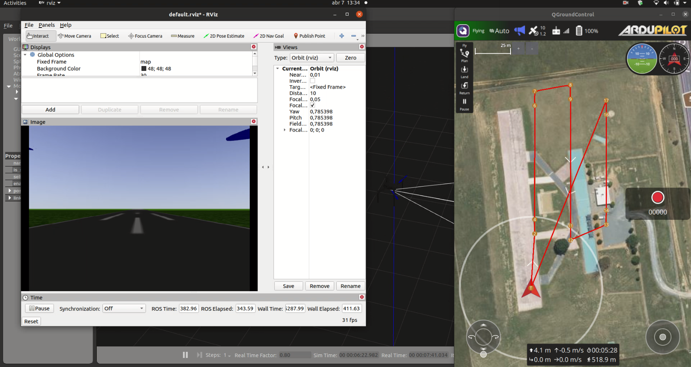

# sky_sim
## Quadcopter simulation with ArduPilot + Gazebo 11 + ROS Noetic

First, be sure that your ArduPilot SITL environment is set correctly. The installation step-by-step is here: https://ardupilot.org/dev/docs/building-setup-linux.html#building-setup-linux

## 1. Install ROS Noetic
  
Follow the instructions here: http://wiki.ros.org/noetic/Installation/Ubuntu

Remember to add the source command to your bashrc file:
```
echo "source /usr/share/gazebo/setup.sh" >> ~/.bashrc
source ~/.bashrc
```

If you already have other ROS distros, be sure to remove their source commands from the bashrc file.
  
## 2. Install Gazebo 11

First, uninstall other versions of Gazebo:
```
sudo apt remove <other-gazebo-versions>
```

Follow the alternative installation: https://classic.gazebosim.org/tutorials?tut=install_ubuntu&cat=install

Add a line to end of `~/.bashrc` by running the following command:
```
echo "source /usr/share/gazebo/setup.sh" >> ~/.bashrc
```
  
## 3. Install the Ardupilot-Gazebo plugin

Create a gz_ws in your home folder:
```
mkdir -p gz_ws/src
```

Then, clone and build the plugin for Gazebo legacy versions:
```
cd gz_ws/src
git clone https://github.com/khancyr/ardupilot_gazebo
cd ardupilot_gazebo
mkdir build
cd build
cmake ..
make -j4
sudo make install
```

If you want to see the complete guide: https://ardupilot.org/dev/docs/sitl-with-gazebo-legacy.html#sitl-with-gazebo-legacy

## 4. Set Up Catkin Workspace

Install the following catkin tools:
```
sudo apt-get install python3-wstool python3-rosinstall-generator python3-catkin-lint python3-pip python3-catkin-tools
pip3 install osrf-pycommon
```

Then, initialize the catkin workspace:
```
mkdir ~/sky_ws
cd ~/sky_ws
mkdir src build log devel
catkin init
```

## 5. Dependencies installation:

Install `mavros` and `mavlink` from source:
```
cd ~/sky_ws
wstool init ~/sky_ws/src

rosinstall_generator --upstream mavros | tee /tmp/mavros.rosinstall
rosinstall_generator mavlink | tee -a /tmp/mavros.rosinstall
wstool merge -t src /tmp/mavros.rosinstall
wstool update -t src
rosdep install --from-paths src --ignore-src --rosdistro `echo $ROS_DISTRO` -y

catkin build
```

Add a line to end of `~/.bashrc` by running the following command:
```
echo "source ~/sky_ws/devel/setup.bash" >> ~/.bashrc
```

update global variables:
```
source ~/.bashrc
```

install geographiclib dependancy:
```
sudo ~/sky_ws/src/mavros/mavros/scripts/install_geographiclib_datasets.sh
```

## 6. Clone Skyrats Simulation ROS package

```
cd ~/sky_ws/src
git clone https://github.com/SkyRats/sky_sim.git
```

Run the following command to tell Gazebo where to look for models:
```
echo "GAZEBO_MODEL_PATH=${GAZEBO_MODEL_PATH}:$HOME/sky_ws/src/sky_sim/models" >> ~/.bashrc
```

## 7. Build instructions

Inside `sky_ws`, run `catkin build`:

```
cd ~/sky_ws
catkin build
```

Update global variables:
```
source ~/.bashrc
```

## 8. Usage

To test the simulation, you need at least two terminal windows:

- Run SITL:
```console
sim_vehicle.py -v ArduCopter -f gazebo-iris --console
```
If the command is not found and the path can't be corrected, you might need to run the following command before running SITL:
```console
cd ~/sky_ws/src/sky_base/ardupilot/Tools/autotest
```

- Launch Gazebo and ROS:
```console
roslaunch sky_sim runway.launch
```

In addition, you can open QGround to test your flight simulation and RViz to visualize the camera image stream.


